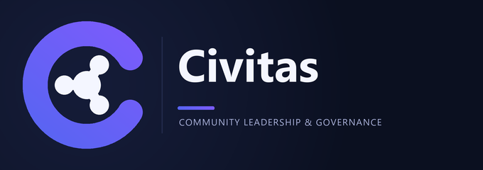

<p align="center">
  
</p>

<h1 align="center">Civitas — Leadership & Community Management for Discord</h1>

<p align="center">
  <a href="https://github.com/DevLJSP/civitas/actions"></a>
  <a href="LICENSE"></a>
  =18" />
  
</p>



Civitas manages the **complete lifecycle of community leadership** inside Discord:

```
Member → Applicant → Candidate → Elected/Appointed → Probation → Leader
→ Senior Leader → Council → term expires / resigns / removed
→ Succession / new election
```

It automates Discord roles + database state across positions, applications,
elections (majority / approval / ranked-choice), mandates, probation,
promotions/demotions, teams, proposals, impeachment, succession, vacancies,
audit history and a persistent scheduler.

## Features

- **Positions**: custom hierarchy, seats, terms, probation, eligibility, selection method
- **Applications**: modal flow, staff approve/reject buttons, private answers
- **Elections**: majority, approval, ranked-choice (IRV/STV-lite), quorum, anonymous mode, scheduled start/end
- **Voting UX**: embeds, buttons, select menus, ephemeral ballots, turnout display
- **Mandates + probation**: auto role assign/remove, approve/fail/extend
- **Promotion / demotion** with audit
- **Teams** with controlled delegation (team leaders only touch their own team)
- **Succession + vacancies** with fallback actions and deadlines
- **Resignation** with confirmation
- **Impeachment/removal**: admin / council / community
- **Proposals**: YES/NO community decisions with quorum + anonymous mode
- **Audit log** (never logs anonymous choices)
- **History / leadership / leaderboard / stats**
- **`/civitas` dashboard** adapting to permissions
- **`/setup` onboarding** incl. quickstart presets
- **Persistent scheduler** in Postgres (survives Discloud restarts, idempotent)
- **Multi-guild isolation**, rate limits, role-safety checks

## Tech stack

Node.js + TypeScript + discord.js v14 + Prisma + Supabase PostgreSQL. Hosted on Discloud (single process, no Docker/Redis).

```
Discord → Civitas Bot (Node/TS/discord.js) → Services → Prisma → Supabase Postgres
```

## Requirements

- Node.js ≥ 18
- A Discord application (bot token + client id)
- A Supabase project (Postgres connection string)

## Local setup

```bash
git clone https://github.com/DevLJSP/civitas.git civitas
cd civitas
npm install
cp .env.example .env
# edit .env: DISCORD_TOKEN, DISCORD_CLIENT_ID, DATABASE_URL
npx prisma generate
npx prisma migrate dev --name init
npm run deploy:commands   # registers slash commands (set GUILD_ID for instant guild refresh)
npm run dev
```

## Environment variables

| Var | Required | Description |
|-----|----------|-------------|
| `DISCORD_TOKEN` | yes | Bot token (Developer Portal → Bot) |
| `DISCORD_CLIENT_ID` | yes | Application client id |
| `DATABASE_URL` | yes | Supabase Postgres connection string (`...?pgbouncer=true` works; use direct for migrations) |
| `NODE_ENV` | no | `production` (default) |
| `GUILD_ID` | no | Dev guild for instant command refresh |
| `LOG_LEVEL` | no | `debug`/`info`/`warn`/`error` |

`.env.example`:

```env
DISCORD_TOKEN=
DISCORD_CLIENT_ID=
DATABASE_URL=
NODE_ENV=production
```

Never commit `.env`. Never log secrets (logger redacts tokens/URLs).

## Prisma + Supabase setup

1. Create a Supabase project → Project Settings → Database → copy **Connection string** (URI).
2. Set `DATABASE_URL` in `.env`.
3. `npx prisma generate`
4. `npx prisma migrate dev --name init` (local) — creates all tables.
5. Production: `npx prisma migrate deploy`.
6. Start: `npm run build && npm start`.

Supabase is used **only as Postgres**. No Edge Functions / Realtime required.

## Discord Developer Portal setup

1. https://discord.com/developers/applications → New Application.
2. Bot → Reset Token → copy to `DISCORD_TOKEN`. Disable “Public Bot” if private.
3. OAuth2 → URL Generator: scopes `bot` + `applications.commands`; permissions: **Manage Roles**, **Send Messages**, **Embed Links**, **Read Message History**, **Use Slash Commands**. (Administrator NOT required.)
4. Invite via generated URL.
5. Copy Application ID → `DISCORD_CLIENT_ID`.
6. Ensure the bot role is **above** any leadership roles it must assign (Server Settings → Roles).

## Discloud deployment

`discloud.config`:

```
NAME=Civitas
TYPE=bot
MAIN=dist/index.js
RAM=100
AUTORESTART=true
VERSION=latest
START=npm start
BUILD=npm run build
```

Notes:

- `TYPE=bot`, `MAIN` points at the compiled output (`BUILD` runs first).
- No `APT` packages needed (pure Node; Prisma engines ship their own binaries).
- `AUTORESTART` requires a Platinum plan or higher; harmless otherwise.
- Start at `RAM=100` and watch for OOM restarts in the first 48h; bump to 200 if needed.

Deploy:

```bash
npm run build
# zip project (excluding node_modules/.env) or use discloud CLI
discloud upload
```

Notes:

- Main process is the Discord bot (`node dist/index.js`).
- All critical state lives in Supabase; restarts recover via scheduler catch-up tick.
- No local permanent storage, no extra services.

## Bot permissions

Least privilege: **Manage Roles** (role sync), **Send Messages**, **Embed Links**, **Read Message History**, **Use Application Commands**, **View Channels**. Never requires Administrator. Every role change verifies hierarchy + manageability and fails safely with audit (`role.sync_fail`).

## Commands

| Command | Description |
|---------|-------------|
| `/setup view/channels/defaults/managers/quickstart` | Onboarding + config |
| `/position create/list/view/edit/delete` | Positions |
| `/apply` | Apply (modal) |
| `/election create/list/nominate/start/close/results/cancel` | Elections |
| `/vote` | Private ballot |
| `/mandate list/appoint/end` | Mandates |
| `/probation decide` | Probation |
| `/promote`, `/demote` | Progression |
| `/team create/list/add/remove` | Teams |
| `/succession set/trigger` | Succession plans |
| `/vacancy list/resolve` | Vacancies |
| `/resign` | Resign with confirmation |
| `/impeachment open/list/decide` | Removal |
| `/proposal create/list/close` | Proposals |
| `/history`, `/leadership`, `/leaderboard` | History |
| `/stats` | Statistics |
| `/civitas` | Dashboard |
| `/tutorial` | Guided setup: first position + test election (new servers start here) |
| `/help` | Command reference, adapts to your permissions |

## Testing

```bash
npm test
```

Covers: majority/approval/ranked-choice, quorum, ties, duplicate-vote detection,
lifecycle guards, scheduler retry/backoff, succession resolution, cross-guild
isolation, rate limits, interaction-id validation, pagination.

## Project structure

```
src/
  commands/      # slash commands (Discord layer)
  events/        # ready, interactionCreate, guild
  interactions/  # customId registries (buttons/modals/selects)
  components/    # reusable UI builders
  services/      # business logic (election engine, voting, mandates…)
  repositories/  # guild-scoped data access
  database/      # Prisma client
  jobs/          # persistent scheduler
  middleware/    # rateLimit, permissions, guild ensure
  utils/         # embeds, errors, crypto, time, ids, messages, logger, pagination
  config/        # env, constants
  types/
prisma/schema.prisma
tests/
```

Discord code is separated from business logic; the voting engine is pure and fully unit-tested.

## Troubleshooting

- `Invalid environment`: fill `.env` from `.env.example`.
- `P1001 can't reach database`: check Supabase URI, SSL, IP allowlist.
- Commands not appearing: run `npm run deploy:commands`; global commands take up to 1h — set `GUILD_ID` for instant refresh.
- `Missing Access` / role not assigned: move bot role above target role; check Manage Roles; see audit `role.sync_fail`.
- Election stuck ACTIVE after downtime: scheduler recovers on boot (30s poll); check `ScheduledTask` rows.
- `You have already voted`: receipt table enforces one ballot; intended.

## Security notes

- Guild ownership validated on every read/write; `assertSameGuild` blocks cross-guild leaks.
- Votes: unique receipt per (election, voter) in a transaction; anonymous ballots store `voterId=NULL`.
- Component ids are `civitas:<ns>:<action>:<id>`; guild always taken from `interaction.guildId`, never from the id.
- Permissions enforced server-side (`ManageGuild`/manager roles/owner); UI hiding is not authorization.
- Rate limits in-memory (Discloud-safe, bounded).
- Errors return friendly messages; stack traces stay in logs.

## Assumptions

- Supabase Postgres available via `DATABASE_URL`; Prisma migrations manage schema.
- Single bot process; horizontal scaling would need advisory locks (current claim uses atomic `updateMany` + stale-claim requeue).
- Ranked-choice Discord UX records first-preference via select (full ranking transfer still counted correctly in engine).
- Activity tracking (`messageCount`/`activeDays`) is a stub for future wiring; inactivity actions are manual by design.

## Contributing

New here? Run `/tutorial` in a server with the bot, then read
[CONTRIBUTING.md](CONTRIBUTING.md). Please follow the
[Code of Conduct](CODE_OF_CONDUCT.md) and report vulnerabilities privately —
see [SECURITY.md](SECURITY.md).

